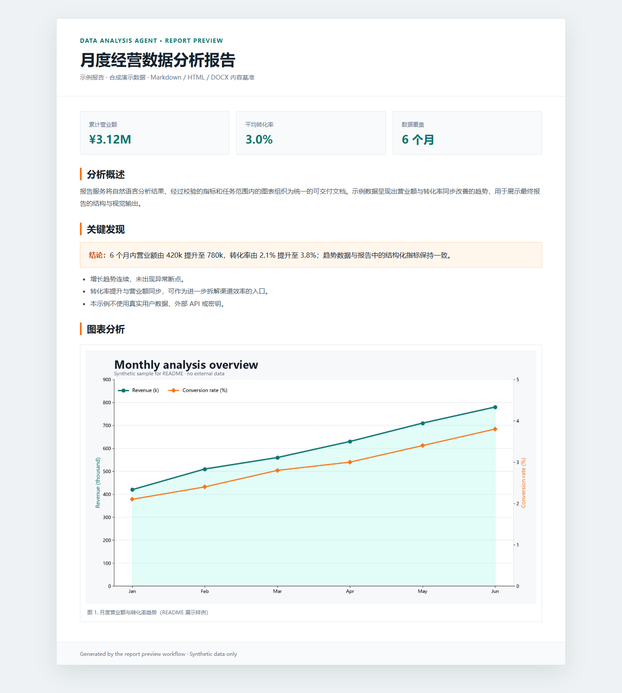
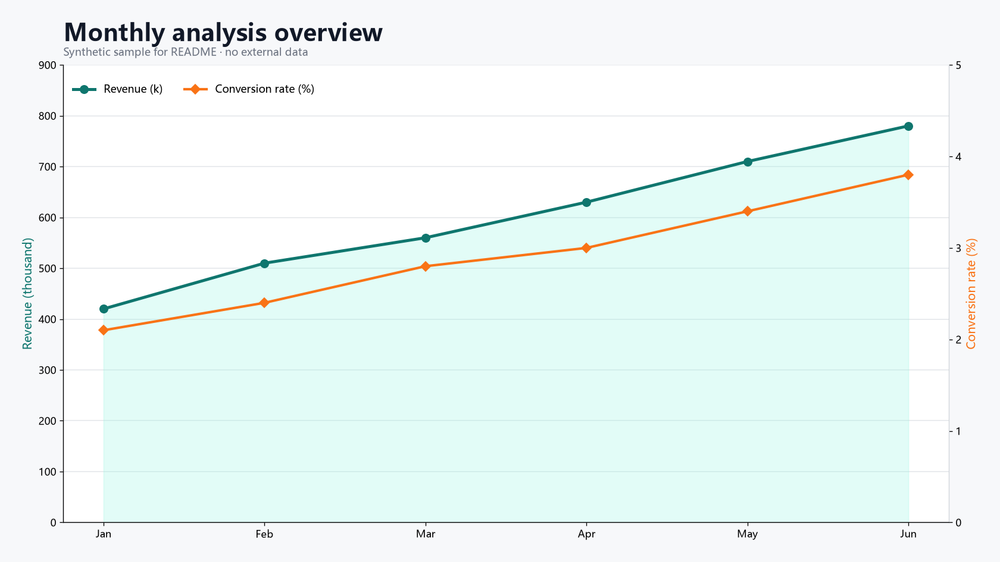
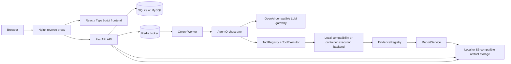
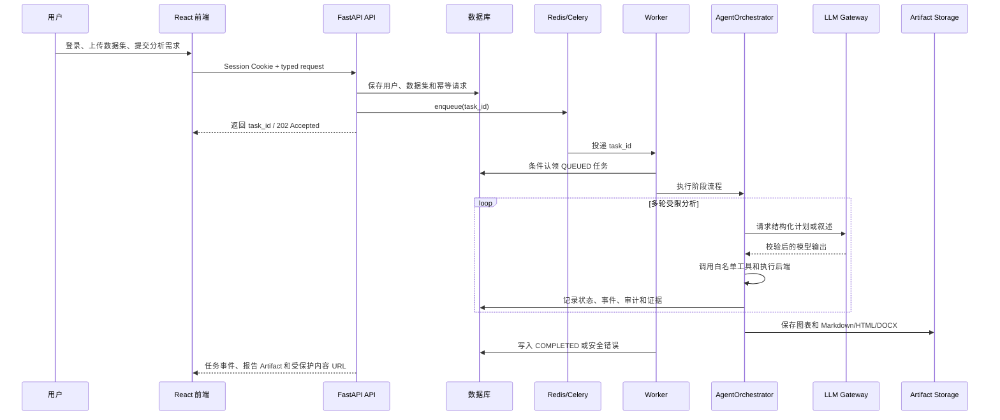

# 数据分析智能体 | Data Analysis Agent

> An installable, offline-testable data analysis agent platform that turns natural-language questions into bounded analysis tasks, verified evidence, visualizations, and shareable reports.

<p align="center">
  
  
</p>

> 上图为仓库内的 README 展示样例，使用合成演示数据，不包含真实 API Key、用户数据或外部服务结果。

## 项目定位

数据分析智能体将自然语言分析需求接入一个可持久化、可审计、可部署的数据分析平台：

- 用 LLM 理解分析目标，并通过固定阶段和强类型工具完成任务编排。
- 对 CSV 数据集执行格式校验、字段画像、权限隔离和可追溯的数据访问。
- 将代码执行、指标、图表和报告组织成任务级证据链。
- 输出 Markdown、HTML 和 DOCX 报告，并通过受保护的 Artifact API 下载结果。
- 对长任务提供数据库任务状态、Redis/Celery Worker、幂等提交、取消、重试和 stale recovery。
- 在生产环境使用一次性受限容器执行分析代码；本地进程内执行器只用于 development/test 兼容路径。

当前项目既提供 Web 应用，也保留 `DataAnalysisAgent` 和 `quick_analysis` 兼容入口，适合本地脚本、API 服务和 Docker Compose 拓扑三种使用方式。

## 核心能力

| 能力 | 当前实现 |
| --- | --- |
| 自然语言分析 | `AgentOrchestrator` 驱动探索、清洗、分析、验证、报告等阶段，支持受限工具调用和阶段事件。 |
| 数据集管理 | CSV 上传、大小/编码/结构校验、Profile、opaque `dataset_id`、用户/管理员授权。 |
| LLM 网关 | OpenAI-compatible provider，支持 DeepSeek 等兼容接口、超时、有限重试、错误分类、结构化输出和调用指标。 |
| 工具与证据 | `ToolRegistry`、输入/输出模型、调用审计、指标复算、图表路径边界和 unsupported numeric claim 检查。 |
| 报告生成 | `ReportService` 以 canonical Markdown 为基准，独立渲染 Markdown、HTML、DOCX；单一格式失败不会删除其他产物。 |
| 异步任务 | FastAPI 提交任务，Redis/Celery Worker 执行；数据库是任务事实源，消息只携带 `task_id`。 |
| 文件与 Artifact | Local/S3-compatible storage，任务级 Artifact 元数据、签名下载令牌、内容访问和访问审计。 |
| Web 前端 | React + TypeScript + Vite，包含登录、数据集、创建分析、任务历史、任务详情和报告详情页面。 |

## 系统架构



生产 Compose 拓扑在上述逻辑组件之外，还包括 `migrate`、`minio-init`、MySQL、Redis、MinIO 和反向代理的健康检查与启动依赖。完整启动顺序见 [本地 Compose 部署指南](docs/deployment/local-compose.md)。

## 任务生命周期



## 仓库结构

```text
.
├── src/data_analysis_agent/
│   ├── agent/             # AgentOrchestrator、DataAnalysisAgent、兼容适配器
│   ├── api/               # FastAPI application、认证、任务、数据集和 Artifact 路由
│   ├── config/            # 环境设置、资源限制和日志配置
│   ├── datasets/          # CSV 校验、Profile、数据集存储和 resolver
│   ├── domain/            # 任务、事件、证据和报告领域模型
│   ├── execution/         # local/container 执行端口、runtime 和审计
│   ├── llm/               # provider-neutral LLM client 和结构化输出
│   ├── persistence/       # SQLAlchemy、Unit of Work、repositories、mappers
│   ├── reports/           # Markdown、HTML、DOCX renderer 和 ReportService
│   ├── services/          # 认证、授权、证据、审计、任务和持久化服务
│   ├── storage/           # Local/S3-compatible storage 和 Artifact access
│   ├── tools/             # 内置工具、注册表、执行器和调用审计
│   └── worker/            # Celery/Redis broker、Worker、取消和恢复
├── frontend/src/          # React 页面、组件、API client、hooks 和 Vitest tests
├── alembic/               # 数据库迁移
├── tests/                 # 后端 unit、contract、integration、API 和 packaging tests
├── docs/deployment/       # Docker Compose、健康检查、HTTPS 和清理说明
├── docs/images/           # README 展示图片
├── compose.yaml           # frontend + API + Worker + MySQL + Redis + MinIO topology
├── .github/workflows/     # GitHub Actions backend/frontend/deployment/integration checks
├── pyproject.toml         # Python package、extras、CLI 和 pytest configuration
└── LICENSE                # MIT License
```

## 快速开始

### 1. 创建 Python 环境

项目要求 Python 3.10+（`requires-python: >=3.10`）。在仓库根目录运行：

```bash
python -m venv .venv
```

基础安装会提供统一 CLI；命令行调用时显式传入输入文件：

```powershell
python -m pip install -e .
data-analysis-agent your_data.csv --query "分析输入数据并生成关键发现和图表"
```

Windows PowerShell：

```powershell
.venv/Scripts/Activate.ps1
python -m pip install --upgrade pip
python -m pip install -e ".[dev,api]"
```

macOS/Linux：

```bash
source .venv/bin/activate
python -m pip install --upgrade pip
python -m pip install -e ".[dev,api]"
```

### 2. 配置 LLM

复制对应环境模板：

```powershell
Copy-Item .env.development.example .env
```

```bash
cp .env.development.example .env
```

编辑 `.env` 时至少确认：

- `OPENAI_API_KEY` 已通过本地环境变量提供，且不写入 Git。
- `OPENAI_BASE_URL` 指向使用中的 OpenAI-compatible provider。
- `OPENAI_MODEL` 使用 provider 支持的模型名称。
- 本地 API 模式配置 `DATABASE_URL`；不使用异步任务时可以暂时不配置 `REDIS_URL`。

配置模板本身不包含真实密钥。`APP_ENV=production` 还要求 MySQL、S3-compatible storage 和 container execution 配置，不能直接复用 development 模板上线。

### 3. 离线验证和命令行帮助

测试使用 Fake Provider/FakeLLM、fake broker 和临时存储，不需要真实 API Key，也不会把测试请求发给外部模型：

```powershell
python -m pytest -q
python -m data_analysis_agent --help
```

前端验证：

```powershell
Push-Location frontend
npm ci
npm run typecheck
npm run test:run
npm run build
Pop-Location
```

### 4. 兼容 Python 入口

`quick_analysis` 适用于已有脚本；`files` 是兼容入口，会在本次分析期间临时处理本地文件。服务化调用推荐先上传数据集，再只传 `dataset_ids`，以便执行和权限边界可追踪。

```python
from data_analysis_agent import quick_analysis

result = quick_analysis(
    query="分析销售趋势，生成关键指标和图表",
    files=["sales.csv"],
    max_rounds=10,
    generate_word_report=True,
)

print(result["report_file_path"])
print(result["html_report_file_path"])
print(result["word_report_file_path"])
```

也可以直接使用兼容 Agent。下面的写法通过 `load_settings()` 读取 `.env`，同时保留 `LLMConfig` 这个公开配置类型：

```python
from data_analysis_agent import DataAnalysisAgent, LLMConfig, load_settings

settings = load_settings()
llm_config = LLMConfig(
    api_key=settings.openai_api_key,
    base_url=settings.openai_base_url,
    model=settings.openai_model,
)
agent = DataAnalysisAgent(
    llm_config=llm_config,
    output_dir="outputs",
    max_rounds=10,
    settings=settings,
)
result = agent.analyze(
    "分析用户行为数据，重点关注转化率",
    files=["user_behavior.csv"],
)
```

## API + Worker 本地运行

这条路径适合需要登录、数据集、任务历史和报告 Artifact 的本地服务。先安装 API/Worker extras：

```powershell
python -m pip install -e ".[dev,api,worker]"
Copy-Item .env.development.example .env
```

编辑 `.env`，设置本地 SQLite、对象存储目录和 Redis，例如使用以下配置意图：

| 配置 | 本地含义 |
| --- | --- |
| `APP_ENV=development` | 使用 development 配置和兼容执行器。 |
| `DATABASE_URL` | 可使用 `sqlite:///./data_analysis_agent.sqlite3`。 |
| `STORAGE_BACKEND=local` | 将数据集和 Artifact 写入本地存储根目录。 |
| `STORAGE_LOCAL_ROOT` | 例如 `./outputs/datasets`。 |
| `REDIS_URL` | 异步任务需要可访问的 Redis，例如本机 `redis://127.0.0.1:6379/0`。 |

若本机没有 Redis，可以使用 Docker 只启动一个 Redis 容器：

```powershell
docker run -d --rm --name data-analysis-redis -p 6379:6379 redis:7
```

执行迁移时显式传入数据库 URL；Alembic 不会自动读取 `.env`：

```powershell
python -m alembic -x db_url=sqlite:///./data_analysis_agent.sqlite3 upgrade head
```

终端一：启动 API：

```powershell
uvicorn data_analysis_agent.api.app:create_app --factory --reload
```

终端二：启动 Worker：

```powershell
data-analysis-agent-worker --env development --recover-stale --pool solo --concurrency 1 --loglevel INFO
```

API 提供 `/docs`、`/openapi.json`、`/health/live` 和 `/health/ready`。主要资源如下：

| 路径 | 用途 |
| --- | --- |
| `POST /api/auth/register`、`POST /api/auth/login`、`POST /api/auth/logout`、`GET /api/auth/me` | Session 认证和当前用户。 |
| `POST/GET/DELETE /api/datasets` | 上传、查看和删除当前用户的数据集。 |
| `POST/GET /api/analysis-tasks` | 提交任务和分页读取任务历史。 |
| `GET /api/analysis-tasks/{task_id}`、`GET /events` | 查看任务状态、阶段事件和 Artifact 摘要。 |
| `POST /api/analysis-tasks/{task_id}/cancel`、`POST /retry` | 取消活动任务或重试失败任务。 |
| `GET /api/artifacts/{artifact_id}`、`/download`、`/content` | 获取 Artifact 元数据和受保护内容。 |

浏览器默认使用服务端 opaque Session 和 `HttpOnly`、`SameSite=Lax` Cookie；`X-User-ID` 只属于测试注入的 principal provider，不是默认生产认证方式。

## Docker Compose 部署

Compose 提供前端、API、Worker、迁移任务、MySQL、Redis、MinIO、Bucket 初始化和 Nginx reverse proxy。完整步骤、健康检查、HTTPS 和数据清理见 [docs/deployment/local-compose.md](docs/deployment/local-compose.md)。

```powershell
Copy-Item .env.compose.example .env.compose
# 编辑 .env.compose，替换 change-me 值，并按需设置 OPENAI_API_KEY
docker compose --env-file .env.compose -f compose.yaml config --quiet
docker compose --env-file .env.compose -f compose.yaml up -d --build
Invoke-WebRequest http://localhost:8080/healthz
docker compose --env-file .env.compose -f compose.yaml ps
```

默认反向代理地址是 `http://localhost:8080`，MySQL 主机端口是 `3307`，MinIO API/UI 端口分别是 `9000/9001`。常规停止使用 `docker compose ... down`；`down -v` 会删除本地 MySQL、Redis 和 MinIO named volumes，应只在明确需要清空环境时使用。

`.env.compose.example` 用于本地拓扑验证，默认 Worker 使用 development 配置和 local execution。生产部署必须单独准备生产环境变量、S3-compatible storage、Docker runtime 和生产分析镜像；不要把本地 Compose 模板直接当作生产配置。

## 报告、证据和结果访问

### 报告格式

| 格式 | 说明 |
| --- | --- |
| Markdown | canonical report 内容，也是其他 renderer 的共同基准。 |
| HTML | 通过安全 Markdown 子集渲染，适合浏览器和前端报告页。 |
| DOCX | 适合下载、分享和打印，支持标题、列表、代码块和图表。 |
| PDF | 当前未实现；未来可通过 renderer 扩展接入。 |

`ReportService` 对每种格式独立处理：HTML 或 DOCX 失败时仍保留已经生成的 Markdown 和分析结果。报告文件、图表文件和下载 URL 会通过任务级 Artifact 元数据关联。

### 证据链

- 指标记录任务、数据集、执行 ID、来源列和代码哈希，并在进入报告上下文前复算。
- 图表只允许引用当前任务输出根目录内、存在且为文件的路径。
- 未验证数字不会被当作事实写入最终报告；无法匹配验证指标的数值 claim 会进入 `PENDING_CONFIRMATION` 或被安全过滤。
- `FACT` 必须绑定验证后的指标或图表；没有数字证据的 `INTERPRETATION` 可以保留定性描述，但不会伪造数字。

## 安全边界

- `APP_ENV=production` 强制使用 `ContainerCodeExecutor`；Docker/runtime 不可用、镜像缺失或容器失败时任务失败，不回退到本地进程执行。
- 生产执行默认 `EXECUTION_NETWORK_MODE=none`，输入数据以只读方式提供，任务输出受限于固定目录、CPU、内存、PID、超时、输出字节数和文件数量边界。
- 执行协议不把 API Key、数据库 URL、宿主绝对路径或原始代码写入消息和审计记录；日志只保留最小必要元数据。
- API 通过 Session、owner/admin authorization、请求 ID、审计事件和 Artifact 访问校验保护跨用户数据。
- Local/S3-compatible storage 的下载 URL 会校验 Artifact、用户主体、令牌、过期时间、对象路径、大小和哈希。
- development/test 的 local executor 是兼容和测试能力，不应作为生产隔离方案。

## 配置索引

| 变量 | 作用 |
| --- | --- |
| `APP_ENV` | `development`、`test` 或 `production`。 |
| `OPENAI_API_KEY`、`OPENAI_BASE_URL`、`OPENAI_MODEL` | OpenAI-compatible LLM 配置。 |
| `DATABASE_URL` | SQLite（本地）或 MySQL（生产/Compose）。 |
| `REDIS_URL` | Celery broker 和异步任务所需的 Redis 地址。 |
| `STORAGE_BACKEND`、`STORAGE_LOCAL_ROOT` | `local` 或 `s3` 存储选择及本地根目录。 |
| `STORAGE_ENDPOINT`、`STORAGE_BUCKET`、`STORAGE_ACCESS_KEY_ID` | S3-compatible/MinIO 配置。Secret 值只放本地环境。 |
| `MAX_TASK_RUNTIME`、`MAX_UPLOAD_SIZE`、`OUTPUT_DIR` | 任务时限、上传上限和输出根目录。 |
| `EXECUTION_BACKEND`、`EXECUTION_IMAGE`、`EXECUTION_NETWORK_MODE` | 分析代码执行方式、生产镜像和网络模式。 |
| `WORKER_POOL`、`WORKER_CONCURRENCY`、`WORKER_MAX_RETRIES`、`WORKER_STALE_AFTER_SECONDS` | Worker 并发、重试和 stale recovery。 |

环境模板：

- `.env.example`：基础兼容入口。
- `.env.development.example`：本地 API/SQLite 开发。
- `.env.test.example`：离线测试。
- `.env.compose.example`：本地 Docker Compose。
- `.env.production.example`：生产配置边界。

## 验证矩阵

| 层级 | 命令 | 说明 |
| --- | --- | --- |
| Backend | `python -m pytest -q` | 后端 unit、contract、API、Worker、storage、report 和 integration tests。 |
| Frontend | `npm run typecheck`、`npm run test:run`、`npm run build` | TypeScript、Vitest 和生产构建。 |
| Packaging | `python -m pytest tests/packaging -q` | 包导出、依赖边界和安装契约。 |
| Deployment | `python -m pytest tests/deployment/test_contract.py -q` | Compose、Dockerfile、健康检查和忽略规则契约。 |
| Static | `python -m compileall -q src`、`git diff --check` | Python 编译和提交空白检查。 |
| GitHub Actions | `.github/workflows/ci.yml` | 在 GitHub runner 上执行后端、前端、部署契约、Compose 和 integration checks。 |

本机未安装 Docker 时，Compose 镜像构建、容器启动、网络、迁移和持久化重启只能在 Docker-enabled CI 或其他 Docker 主机验证；不要把静态契约测试结果写成完整运行时验证。

## 已知限制

- 当前报告 renderer 集合不包含 PDF。
- 真实 LLM 分析需要可用的 provider、模型和 API Key；离线测试不会替代真实模型质量评估。
- 生产执行需要可用 Docker runtime 和已准备的分析镜像，且生产环境禁止回退到 local executor。
- 本 README 的两张展示图是合成数据样例；真实业务结果应通过受保护 Artifact API 或本地输出目录访问，不应把 `outputs/` 原始运行产物直接提交到公开仓库。

## GitHub 提交

提交前请使用 [GitHub 提交检查单](docs/GITHUB_SUBMISSION_CHECKLIST.md)。它会检查：

- `.env`、数据库文件、outputs、证书和密钥是否保持在 Git 忽略边界内。
- 后端、前端和 Markdown/资产验证是否完成。
- `git add` 是否只包含 README、展示图片和本次确定要提交的项目文件。
- staged diff 是否经过 `git diff --cached --check` 和人工审阅。

当前工作区可能同时存在其他功能开发改动；第一次上传时应使用显式路径，避免无差别执行 `git add .`。

## 许可证

本项目以 [MIT License](LICENSE) 发布。
